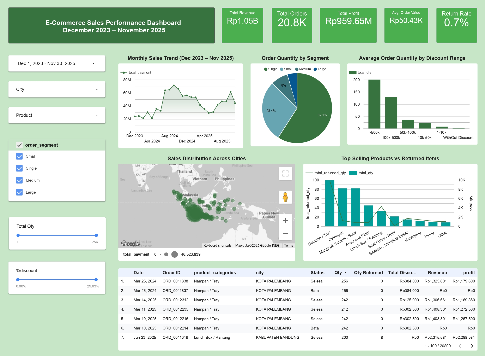

# 📊 E-Commerce Sales Analysis (2023-2025)

---

## 📌 Tentang Proyek

Proyek ini bertujuan untuk menganalisis data penjualan e-commerce periode **Desember 2023 - November 2025** dengan total **20.848 transaksi**. Analisis dilakukan menggunakan **Python** untuk data cleaning dan eksplorasi data (EDA), serta **Looker Studio** untuk visualisasi interaktif.

### 🎯 Tujuan Analisis

- Mengidentifikasi pola musiman dan faktor-faktor yang mempengaruhi penjualan
- Menemukan kategori produk dan kota paling menguntungkan
- Menganalisis dampak diskon terhadap volume pembelian
- Menganalisis status pesanan, pembatalan, dan pengembalian barang

---

## 📊 Dataset

### Informasi Dataset

| **Periode** | Desember 2023 - November 2025 |
|-------------|-------------------------------|
| **Total Transaksi** | 20.848 orders |
| **Total Pendapatan** | Rp 1,0 Miliar |
| **Total Profit** | Rp 969,2 Juta |
| **Jumlah Kolom** | 24 kolom |
| **Cakupan Wilayah** | 34 Provinsi di Indonesia |

### Struktur Data

| # | Kolom | Tipe Data | Deskripsi |
|---|-------|-----------|-----------|
| 0 | `order_id` | Text | ID unik pesanan |
| 1 | `total_qty` | Integer | Jumlah total barang yang dibeli dalam 1 pesanan |
| 2 | `total_weight_gr` | Integer | Total berat pesanan (gram) |
| 3 | `total_returned_qty` | Integer | Jumlah barang yang dikembalikan dalam 1 pesanan |
| 4 | `total_discount` | Integer | Total diskon yang diterima (Rp) |
| 5 | `product_categories` | Text | Kategori produk yang dibeli |
| 6 | `num_product_categories` | Integer | Jumlah kategori produk dalam 1 pesanan |
| 7 | `order_status` | Text | Status pesanan: `Selesai`, `Batal` |
| 8 | `cancellation` | Text | Alasan pembatalan (jika pesanan batal) |
| 9 | `shipping_option` | Text | Opsi pengiriman yang dipilih |
| 10 | `payment_method` | Text | Metode pembayaran: `COD`, `Transfer`, `E-Wallet` |
| 11 | `city` | Text | Kota pengiriman |
| 12 | `province` | Text | Provinsi pengiriman |
| 13 | `shipping_cost` | Integer | Biaya ongkos kirim yang dibayar (Rp) |
| 14 | `estimated_shipping_cost_discount` | Integer | Estimasi potongan biaya pengiriman dari platform (Rp) |
| 15 | `total_payment` | Integer | Total pembayaran customer (Rp) |
| 16 | `estimated_shipping_cost` | Integer | Estimasi ongkos kirim asli sebelum diskon (Rp) |
| 17 | `order_time` | DateTime | Waktu pesanan dibuat |
| 18 | `source_file` | Text | Sumber data (nama file) |
| 19 | `month_period` | Text | Bulan dan tahun pesanan (format: YYYY-MM) |
| 20 | `day_of_week` | Text | Hari dalam minggu (Senin, Selasa, dst) |
| 21 | `profit` | Integer | Keuntungan bersih per pesanan (Rp) |
| 22 | `order_segment` | Text | Segmen pesanan berdasarkan jumlah pembelian |
| 23 | `discount_segment` | Text | Rentang diskon (kategorisasi) |

---

## 📈 Dashboard Interaktif

Lihat visualisasi interaktif di Looker Studio:

🔗 **[Klik di sini untuk membuka Dashboard](https://datastudio.google.com/reporting/5e1dc0bd-5202-4715-b66e-4a44bae59582)**

### 📊 Preview Dashboard

---

## 🛠️ Tools yang Digunakan

| Tools | Fungsi |
|-------|--------|
| **Python 3.9+** | Data cleaning & EDA |
| **Pandas** | Library Python Manipulasi dan analisis data |
| **NumPy** | Library Python Perhitungan numerik |
| **Matplotlib & Seaborn** | Library Python Visualisasi data |
| **Looker Studio** | Dashboard interaktif |
| **Jupyter Notebook** | Teks Editor Python |
